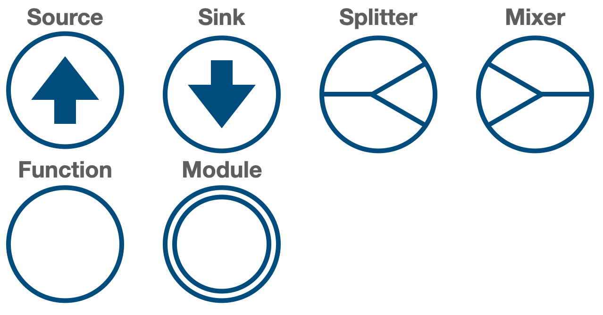
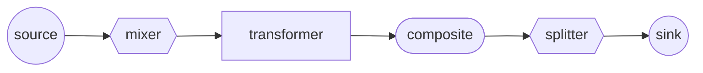
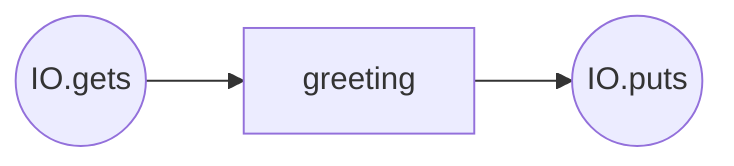
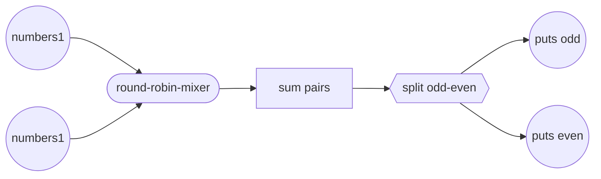
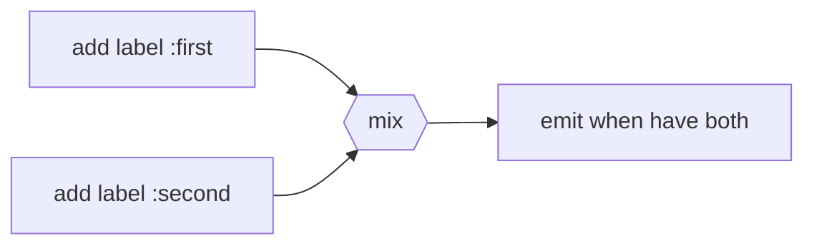

# Strom

## Composable components for stream processing

### Strom provides a set of abstractions for creating, routing and modifying streams of data.

## Notation


In the "mermaid" notation, I suggest the following shapes:
- circles for a sink and a source.
- diamonds for a mixer and a splitter.
- simple rectangle for a transformer.
- rounded rectangle for a composite.

See the example below. 


## Hello, World!


```elixir
io_gets = Strom.Source.IOGets.new()
source = :stream |> Strom.Source.new(io_gets)

function = fn string -> "Hello, #{string}!" end
transformer = :stream |> Strom.Transformer.new(function, nil, buffer: 1)

io_puts = Strom.Sink.IOPuts.new()
sink = :stream |> Strom.Sink.new(io_puts, true)

greeter = Strom.Composite.new([source, transformer, sink])
greeter = Strom.Composite.start(greeter)

Strom.Composite.call(%{}, greeter)
```
Add see:
```shell
iex(13)> Strom.Composite.call(%{}, greeter)
IOGets> world
Hello, world!
```

#### The "flow" data-structure
One can see an empty map as the first argument in Strom.Composite.call(%{}, greeter).

Strom components operates with "flow" - a named set of streams. It's a map with streams as values and their names as keys:

For example:
```elixir
flow = %{
  stream1: Stream.cycle([1, 2, 3]),
  stream2: ["a", "b", "c"]
}
```
Flow can be empty - `%{}`.

A source adds a new stream to flow. A sink runs the stream of given name and removes it from flow.

A mixer mixes several streams into one. A splitter does the opposite.

A transformer modifies a stream (or streams).

## A more sophisticated example

### The problem
There are two streams of data. One have to sum pairs of numbers from each stream respectively, 
then produce two steams: one with the odd numbers, another with the even ones.

### Solution
The flow chart for possible solution:


#### Components
The origins for sources here will be just simple lists of numbers.
See [sources](https://github.com/antonmi/Strom/blob/main/lib/source/) for other examples of sources. It's easy to implement your own source.
```elixir
source1 = Strom.Source.new(:numbers1, [1, 2, 3, 4, 5])
source2 = Strom.Source.new(:numbers2, [10, 20, 30, 40, 50])
```

Sinks will use simple IOPuts origin. See more examples here: [sinks](https://github.com/antonmi/Strom/blob/main/lib/sink/)
```elixir
origin_odd = Strom.Sink.IOPuts.new("odd: ")
sink_odd = Strom.Sink.new(:odd, origin_odd)

origin_even = Strom.Sink.IOPuts.new("even: ")
sink_even = Strom.Sink.new(:even, origin_even)
```

Now comes a tricky part - the round-robin mixer. It's a composite component that has four components inside:



The round-robin mixer first adds labels to each event in order to now from which stream comes a number. Then it mixes streams. 
The last transformer will wait until it has numbers from both streams and then emit a pair of events.

```elixir
defmodule RoundRobinMixer do
  alias Strom.{Mixer, Transformer}

  def add_label(event, label) do
    {[{event, label}], label}
  end

  def call({number, label}, acc) do
    [another] = Enum.reject(Map.keys(acc), &(&1 == label))

    case Map.fetch!(acc, another) do
      [hd | tl] ->
        {[hd, number], Map.put(acc, another, tl)}

      [] ->
        numbers = Map.fetch!(acc, label)
        {[], Map.put(acc, label, numbers ++ [number])}
    end
  end

  def components() do
    [
      Transformer.new(:first, &__MODULE__.add_label/2, :first),
      Transformer.new(:second, &__MODULE__.add_label/2, :second),
      Mixer.new([:first, :second], :numbers),
      Transformer.new(:numbers, &__MODULE__.call/2, %{first: [], second: []})
    ]
  end
end

round_robin = Strom.Composite.new(RoundRobinMixer.components())
```

The "sum pairs" transformer is simple. It will save first number in accumulator and waits the second one to produce the sum.
```elixir
function = fn number, acc ->
  if acc do
    {[number + acc], nil}
  else
    {[], number}
  end
end

sum_pairs = Strom.Transformer.new(:numbers, function, nil)
```

The splitter will split the `:numbers` stream into two streams: `:odd` and `:even`

```elixir
splitter = Strom.Splitter.new(:numbers, %{odd: &(rem(&1, 2) == 1), even: &(rem(&1, 2) == 0)})
```

Ok, it's almost done. One thing that you may have noticed - the sources produces `:numbers1` and `:number2` streams.
However the round-robin composite operates with the `:first` and `:second` streams. One should simple rename the streams in flow.

For consistency there is the `Renamer` component:

```elixir
renamer = Strom.Renamer.new(%{numbers1: :first, numbers2: :second})
```

Ok. Now we are ready to combine all the components. There will be another composite.
```elixir
final_composite = [
  source1,
  source2, 
  renamer, 
  round_robin,
  sum_pairs,
  splitter,
  sink_odd,
  sink_even
] |> Strom.Composite.new()
```

Now, just start it and call on an empty flow:
```elixir
final_composite = Strom.Composite.start(final_composite)
Strom.Composite.call(%{}, final_composite)
```

Add see smth like that in console:
```shell
iex(18)> Strom.Composite.call(%{}, final_composite)
%{}
even: 22
odd: 11
even: 44
odd: 33
odd: 55
```

## More info:

Read `@moduledoc` for components.

See [examples](https://github.com/antonmi/Strom/blob/main/test/examples/) in tests.